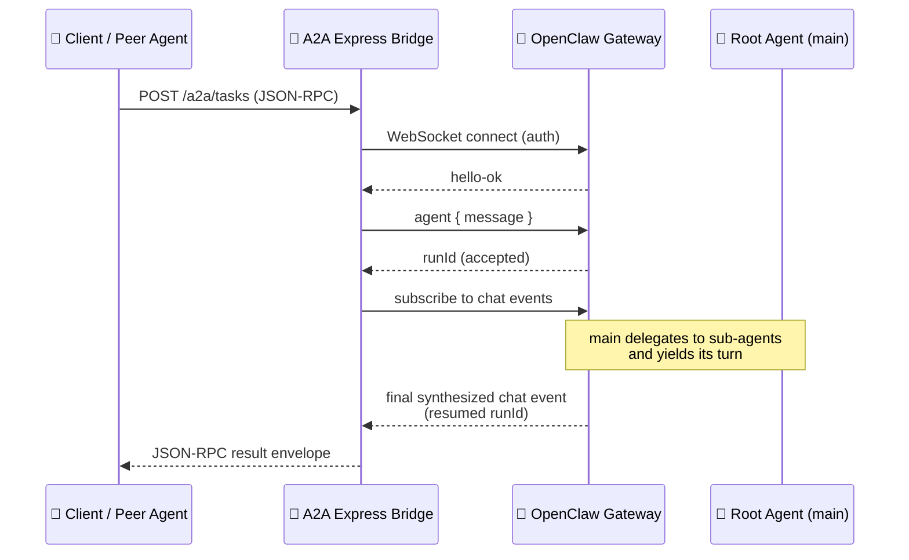
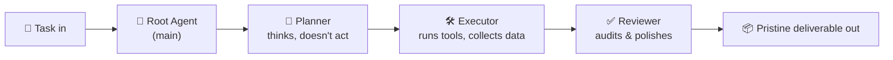

# 🐾 OpenClaw A2A Bridge

> A small fleet of AI agents that talk to each other over a network, discover one another automatically, and collaborate to get work done.

---

## ✨ What is this?

Imagine a tiny company where every employee is an AI agent. One is a **Researcher**, one is a **Coder**, and they can hand work to each other over the network — just like colleagues messaging a task across the office.

This project is a working **proof of concept** of that idea. It wires up several OpenClaw-powered agent containers on a shared Docker-style network, lets them announce themselves to a registry so peers can find them, and routes JSON-RPC task requests between them.

No hardcoded addresses. No manual wiring. Agents show up, register, and start collaborating.

---

## 🧭 How it works

### The big picture

Your Mac runs a Fedora virtual machine. Inside that VM, Podman hosts a small bridge network with three containers: a registry and two agents.

```mermaid
flowchart TD
    subgraph Mac["💻 macOS Host"]
        WS["📁 openclaw-workspace<br/>(your code, live-mounted)"]
    end

    subgraph VM["🐧 Fedora VM via Tart"]
        subgraph Net["🌐 openclaw-net bridge"]
            REG["📋 Apicurio Registry<br/>Agent discovery"]
            RES["🔬 Researcher<br/>agent container"]
            COD["💻 Coder<br/>agent container"]
        end
    end

    WS -- "VirtioFS mount" --> VM
    REG -. "registers" .-> RES
    REG -. "registers" .-> COD
    RES -- "A2A code delegation<br/>(reviewer → coder:3000)" --> COD
    COD -.x "one-way only<br/>(Coder never calls back)" .-> RES

    classDef pending stroke-dasharray: 5 5,stroke:#e0a800,color:#7a6000;
    class RES pending;
```

> ⚠️ The Researcher→Coder delegation edge is the **intended design** but is **pending enforcement** — see [Known limitations](#-known-limitations) below. The dashed style marks it as not-yet-reliable.

### What happens when you send a task

Each agent container runs two cooperating processes: an **Express bridge** (the network front door) and the **OpenClaw Gateway** (the cognitive engine). The bridge receives your JSON-RPC request, hands it to the gateway, waits for the agent to finish thinking, and returns a clean JSON-RPC response.



### Inside an agent: the three-node loop

The root agent never does the work itself. It hands every task to a standardized trio of sub-agents that plan, execute, and review — then returns the polished result.



| Node | Job | Won't do |
|------|-----|----------|
| 🧭 **Planner** | Break the task into a clear step-by-step blueprint | Run any tools |
| 🛠️ **Executor** | Carry out the plan — scrape, code, fetch, write files | Judge its own output |
| ✅ **Reviewer** | Audit for accuracy, safety, and clean JSON formatting | Re-do the work |

> 🔬 **On the Researcher**, the reviewer also carries an **A2A code-delegation** directive: when a task needs code, it should hand the code work to the **Coder** agent over the network instead of writing it itself. This is the intended design but is **pending enforcement** — see [Known limitations](#-known-limitations) below.

---

## ⚠️ Known limitations

End-to-end testing (2026-08-01) surfaced two agent-platform limitations that are **not yet resolved** and are tracked in follow-up issues:

1. **Prompt-only A2A delegation does not fire.** The Researcher's reviewer is told (via its `IDENTITY.md`) to delegate code work to the Coder agent over A2A rather than writing the code itself. In practice the reviewer — a capable model with full tool access — overrides the prompt rule and writes the code directly, so the Coder agent never receives a delegation. Proven across 4 tests with both the reviewer and the executor as the delegation point. This is an **agent-platform limitation**, not a model limitation (other non-OpenClaw agents perform sub-agent delegation reliably). Tracked in issues #6, #7, and #8.
2. **Orchestrator early-termination (mitigated, not fully solved).** The Researcher's root agent can end its turn mid-loop, capturing narration as the final answer and orphaning the reviewer. Three guardrails in `main/IDENTITY.md` (TRUNCATED-OUTPUT RULE, STEP 5→6 ATOMIC, EXECUTOR ERROR RULE) fix the known trigger paths, but a residual truncation-triggered case was still observed in test 5.

The **orchestrator guardrails are in place and working**; the planner→executor→reviewer loop now completes. What's pending is the actual cross-agent delegation firing reliably. See [AGENTS.md §11](./AGENTS.md#11-known-constraints--workarounds) for the full technical detail.

---

## 🤖 Meet the fleet

| Agent | Superpower | Specialty |
|-------|-----------|-----------|
| 🔬 **Researcher** | Finding things out | Search strategy, web scraping, fact-checking, citations |
| 💻 **Coder** | Building things | Code architecture, file creation, syntax & security review |

Both agents share the **same Docker image** and the **same internal architecture** — only their persona and domain focus differ. Adding a third agent is mostly a matter of giving it its own identity and state directory.

---

## 🚀 Quick start

```bash
# Build and launch the whole fleet
podman-compose -f podman-compose.yml up -d --build

# Watch an agent work
podman logs -f researcher

# Send a task from inside the network
podman exec -it researcher curl -s http://coder:3000/a2a/tasks \
  -H "Content-Type: application/json" \
  -d '{"jsonrpc":"2.0","method":"task","params":{"task":"hello"},"id":"1"}' | jq .

# Tear it all down
podman-compose -f podman-compose.yml down
```

> 💡 The agent containers don't expose host ports by default. Use `podman exec` to reach them from inside the network, or add port mappings to `podman-compose.yml`.

---

## 📁 Project layout

```
openclaw-workspace/
├── Dockerfile              # Shared agent image
├── ecosystem.config.js     # PM2 runs the bridge + gateway in each container
├── index.js                # The A2A Express bridge (network front door)
├── podman-compose.yml      # The whole fleet, declaratively
├── AGENTS.md               # 📖 The full technical architecture reference
└── agents/
    ├── researcher/.openclaw/   # Researcher's isolated brain
    └── coder/.openclaw/        # Coder's isolated brain
```

Each agent keeps its own memory, history, and prompt configuration in a separate `.openclaw/` directory, so the two never bleed into each other.

---

## 📖 Want the deep technical details?

This README is the friendly tour. For the full architectural reference — WebSocket lifecycle, environment variables, known constraints, and workarounds — see **[AGENTS.md](./AGENTS.md)**.
