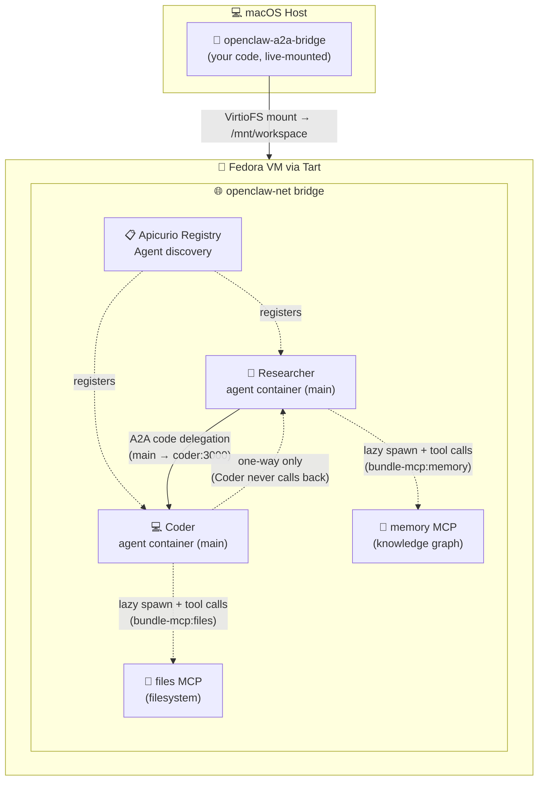
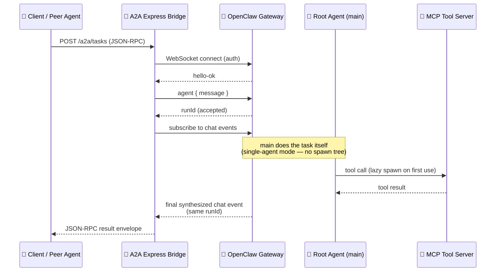
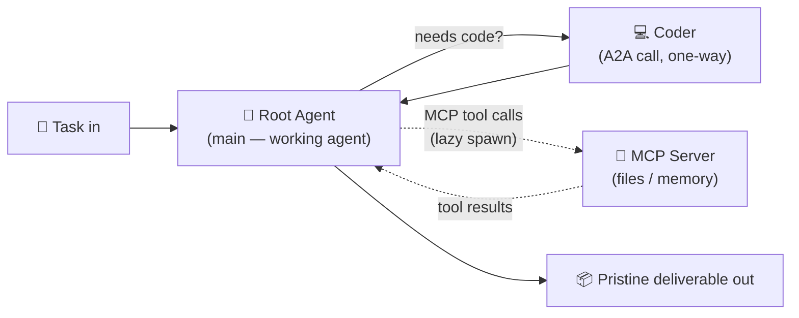
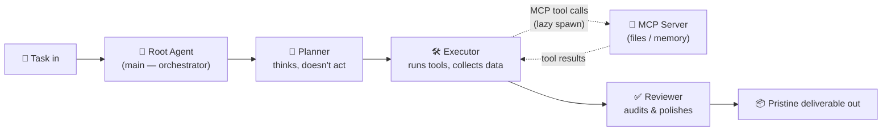

# 🐾 OpenClaw A2A Bridge

> A small fleet of AI agents that talk to each other over a network, discover one another automatically, and collaborate to get work done.

---

## ✨ What is this?

Imagine a tiny company where every employee is an AI agent. One is a **Researcher**, one is a **Coder**, and they can hand work to each other over the network — just like colleagues messaging a task across the office.

This project is a working **proof of concept** of that idea. It wires up several OpenClaw-powered agent containers on a shared Docker-style network, lets them announce themselves to a registry so peers can find them, and routes JSON-RPC task requests between them.

No hardcoded addresses. No manual wiring. Agents show up, register, and start collaborating.

> ⚠️ **Current mode — single-agent-per-container.** Each agent container runs **one working agent** (`main`) that does the task itself. Cross-agent handoff works: when the Researcher's task needs code, `main` calls the Coder's bridge directly over A2A and folds the result into its answer. The original **tri-node** design (a planner → executor → reviewer sub-agent loop inside each agent, with the Researcher's reviewer delegating code to the Coder) is **parked as future work** pending an OpenClaw fix — sub-agents can't reliably drive cross-agent A2A calls. The tri-node artifacts are preserved (not deleted) for revival. See [Known limitations](#-known-limitations) and [AGENTS.md §8](./AGENTS.md#8-the-cognitive-engine-prompt-architecture) for the full story.

---

## 🧭 How it works

### The big picture

Your Mac runs a Fedora virtual machine. Inside that VM, Podman hosts a small bridge network with three containers: a registry and two agents.


```mermaid
flowchart TD
    subgraph Mac["💻 macOS Host"]
        WS["📁 openclaw-a2a-bridge<br/>(your code, live-mounted)"]
    end

    subgraph VM["🐧 Fedora VM via Tart"]
        subgraph Net["🌐 openclaw-net bridge"]
            REG["📋 Apicurio Registry<br/>Agent discovery"]
            RES["🔬 Researcher<br/>agent container (main)"]
            COD["💻 Coder<br/>agent container (main)"]
            MCPMEM["🧠 memory MCP<br/>(knowledge graph)"]
            MCPFILES["📁 files MCP<br/>(filesystem)"]
        end
    end

    WS -- "VirtioFS mount → /mnt/workspace" --> VM
    REG -. "registers" .-> RES
    REG -. "registers" .-> COD
    RES -- "A2A code delegation<br/>(main → coder:3000)" --> COD
    COD -. "one-way only<br/>(Coder never calls back)" .-> RES
    RES -. "lazy spawn + tool calls<br/>(bundle-mcp:memory)" .-> MCPMEM
    COD -. "lazy spawn + tool calls<br/>(bundle-mcp:files)" .-> MCPFILES
```

> 🔌 Each agent also runs one **MCP tool server** (dashed edges above): the Researcher gets an in-memory knowledge-graph server (`@modelcontextprotocol/server-memory`), the Coder gets a filesystem server (`@modelcontextprotocol/server-filesystem`) scoped to its workspace. MCP servers spawn lazily on first tool invocation, not at gateway boot. Live-tested 2026-08-11 — see [AGENTS.md §12](./AGENTS.md#12-mcp-tool-servers).

> ✅ The Researcher→Coder edge is a **working direct A2A call** in single-agent mode: when the Researcher's `main` gets a task that needs code, it curls the Coder's bridge, the Coder's `main` generates the code, and the Researcher folds `result.output` into its answer. Live-tested 2026-08-11. The dashed return edge marks the one-way boundary (Coder never calls back).

### What happens when you send a task

Each agent container runs two cooperating processes: an **Express bridge** (the network front door) and the **OpenClaw Gateway** (the cognitive engine). The bridge receives your JSON-RPC request, hands it to the gateway, waits for the agent to finish thinking, and returns a clean JSON-RPC response.


```mermaid
sequenceDiagram
    participant C as 🧑 Client / Peer Agent
    participant B as 🌉 A2A Express Bridge
    participant G as 🧠 OpenClaw Gateway
    participant M as 🤖 Root Agent (main)
    participant MCP as 🔌 MCP Tool Server

    C->>B: POST /a2a/tasks (JSON-RPC)
    B->>G: WebSocket connect (auth)
    G-->>B: hello-ok
    B->>G: agent { message }
    G-->>B: runId (accepted)
    B->>G: subscribe to chat events
    Note over G,M: main does the task itself<br/>(single-agent mode — no spawn tree)
    M->>MCP: tool call (lazy spawn on first use)
    MCP-->>M: tool result
    G-->>B: final synthesized chat event<br/>(same runId)
    B-->>C: JSON-RPC result envelope
```

> 🔌 The MCP Tool Server participant represents the per-agent MCP server (Coder: `files`, Researcher: `memory`). It spawns lazily on the first tool call within the run and stays alive for the session. Not every task invokes an MCP tool — the interaction above is optional.

### Inside an agent: one working agent (single-agent mode)

Each agent container runs **one working agent** (`main`) that does the task itself using full tool access — no sub-agents, no spawn tree. When the Researcher's task needs code, `main` calls the Coder's bridge directly over A2A.


```mermaid
flowchart LR
    IN["📨 Task in"] --> MAIN["🤖 Root Agent<br/>(main — working agent)"]
    MAIN -- "needs code?" --> COD["💻 Coder<br/>(A2A call, one-way)"]
    COD --> MAIN
    MAIN -. "MCP tool calls<br/>(lazy spawn)" .-> MCP["🔌 MCP Server<br/>(files / memory)"]
    MCP -. "tool results" .-> MAIN
    MAIN --> OUT["📦 Pristine deliverable out"]
```

> 🔌 The MCP Server node is the per-agent external tool server: `files` (`@modelcontextprotocol/server-filesystem`) for the Coder, `memory` (`@modelcontextprotocol/server-memory`) for the Researcher. It spawns lazily on first tool invocation and surfaces tools under the `bundle-mcp` plugin namespace (e.g. `files__list_directory`, `memory__create_entities`).

| Agent | Job | Won't do |
|------|-----|----------|
| 🔬 **Researcher `main`** | Research, fact-check, synthesize — and delegate any code work to the Coder over A2A | Write code itself |
| 💻 **Coder `main`** | Generate code from a spec, return a structured JSON deliverable | Call back to the Researcher (leaf node) |

> 🔬 **A2A code delegation (one-way: Researcher → Coder).** When the Researcher's task requires code, `main` curls the Coder's bridge at `http://coder:3000/a2a/tasks`, the Coder's `main` generates the code, and the Researcher folds `result.output` into its final answer. The Coder never calls back. Live-tested 2026-08-11.

<details>
<summary><b>🏗️ Parked future design — the tri-node sub-agent loop</b> (click to expand)</summary>

The **intended** architecture is a tri-node loop inside each agent: `main` acts as an orchestrator-only router that delegates every task to a standardized trio of sub-agents — plan, execute, review — then returns the polished result.


```mermaid
flowchart LR
    IN["📨 Task in"] --> MAIN["🤖 Root Agent<br/>(main — orchestrator)"]
    MAIN --> P["🧭 Planner<br/>thinks, doesn't act"]
    P --> E["🛠️ Executor<br/>runs tools, collects data"]
    E -. "MCP tool calls<br/>(lazy spawn)" .-> MCP["🔌 MCP Server<br/>(files / memory)"]
    MCP -. "tool results" .-> E
    E --> R["✅ Reviewer<br/>audits & polishes"]
    R --> OUT["📦 Pristine deliverable out"]
```

> 🔌 The MCP Server node is the same per-agent external tool server as in single-agent mode (`files` for the Coder, `memory` for the Researcher). In the tri-node design the executor is the node that runs tools, so it would be the one invoking MCP tools. The MCP config is independent of the agent architecture — it works the same in either mode.

| Node | Job | Won't do |
|------|-----|----------|
| 🧭 **Planner** | Break the task into a clear step-by-step blueprint | Run any tools |
| 🛠️ **Executor** | Carry out the plan — scrape, code, fetch, write files | Judge its own output |
| ✅ **Reviewer** | Audit for accuracy, safety, and clean JSON formatting | Re-do the work |

On the Researcher, the reviewer would also carry an **A2A code-delegation** directive (hand code work to the Coder instead of writing it). This is **parked** — see [Known limitations](#-known-limitations). The artifacts are preserved for revival: sub-agent entries are commented out in `openclaw.json` (JSON5), the orchestrator prompt is saved as `IDENTITY.tri-node.md`, the sub-agent directories are untouched, and git tag `v0.1.0` (commit `5e428c0`) is the revival baseline. See [AGENTS.md §8](./AGENTS.md#8-the-cognitive-engine-prompt-architecture) for the revival path.

</details>

---

## ⚠️ Known limitations

End-to-end testing surfaced one agent-platform limitation that shapes the current architecture:

1. **Sub-agents can't drive cross-agent A2A calls (parked the tri-node design).** The original design had each agent's `main` act as an orchestrator that delegates to a planner → executor → reviewer sub-agent loop, with the Researcher's reviewer handing code work to the Coder over A2A. In practice, OpenClaw sub-agents cannot reliably drive cross-agent A2A calls, and the prompt-level delegation directive was overridden by the model's task-completion instinct — the reviewer wrote the code itself and the Coder's bridge never received a delegation. Proven across 4 end-to-end tests (2026-08-01) with both the reviewer and the executor as the delegation point. This is an **agent-platform limitation**, not a model limitation (other non-OpenClaw agents perform sub-agent delegation reliably).

   **Workaround — single-agent-per-container mode (#9).** Each container runs one working agent (`main`) that does the task itself with full tool access. Cross-agent A2A **does** work in this mode: the Researcher's `main` curls the Coder's bridge directly when a task needs code (live-tested 2026-08-11, #10). The tri-node design is **parked, not deleted** — artifacts are preserved for revival: sub-agent entries are commented out in `openclaw.json` (JSON5), the orchestrator prompt is saved as `IDENTITY.tri-node.md`, the sub-agent directories are untouched, and git tag `v0.1.0` (commit `5e428c0`) is the revival baseline. Making the tri-node fire deterministically is tracked in issues #6 (umbrella), #7 (plugin/extend OpenClaw), and #8 (fork/build a new runtime) — these are **stale future options** pending an OpenClaw fix, not active work.

> 💡 **Residual output-formatting hygiene.** The A2A round-trip works end-to-end, but the model occasionally prefixes its final JSON with narration or wraps output in markdown fences. The bridge's `JSON.parse` fallback to raw string handles these gracefully — they are prompt-enforcement issues (the model's task-completion instinct), not architectural blockers. See [AGENTS.md §11](./AGENTS.md#11-known-constraints--workarounds) for the full technical detail.

---

## 🤖 Meet the fleet

| Agent | Superpower | Specialty |
|-------|-----------|-----------|
| 🔬 **Researcher** | Finding things out | Search strategy, web scraping, fact-checking, citations |
| 💻 **Coder** | Building things | Code architecture, file creation, syntax & security review |

Both agents share the **same Docker image** and the **same internal architecture** — only their persona and domain focus differ. Adding a third agent is mostly a matter of giving it its own identity and state directory.

> 🔌 **MCP tool servers.** Each agent also runs one external **MCP (Model Context Protocol)** tool server alongside the built-in OpenClaw tools: the **Coder** gets a filesystem server (`@modelcontextprotocol/server-filesystem`) scoped to its workspace, and the **Researcher** gets an in-memory knowledge-graph server (`@modelcontextprotocol/server-memory`). MCP tools surface to the agent under the `bundle-mcp` plugin namespace (e.g. `files__list_directory`, `memory__create_entities`) and spawn lazily on first use. Live-tested 2026-08-11 — both servers start, accept tool calls, and return real results. See [AGENTS.md §12](./AGENTS.md#12-mcp-tool-servers) for the config shape and validation.

---

## 🚀 Quick start

> ⚠️ **Heads up:** the VS Code integrated terminal can't reach the VM's local subnet (a known VS Code regression). All commands that target the VM or containers go through a **tmux bridge** — a tmux server started from an interactive Terminal.app shell. The `vm-bridge.sh` helper automates this. See [AGENTS.md §10](./AGENTS.md#10-operational-notes) for the full details.

```bash
# --- From an interactive Terminal.app shell (NOT the VS Code terminal) ---

# Start the VM (if not already running)
poc-openclaw-01   # alias: tart run poc-openclaw-01 --no-graphics --dir ~/GC/openclaw-a2a-bridge:tag=workspace &

# Start the tmux bridge (idempotent — safe to re-run)
./vm-bridge.sh start

# --- Now from anywhere (including the VS Code agent terminal) ---

# Build and launch the whole fleet
./vm-bridge.sh run 'cd /mnt/workspace && podman-compose -f podman-compose.yml up -d --build'

# Check fleet status (bridge + VM + containers)
./vm-bridge.sh status

# Watch an agent work
./vm-bridge.sh run 'podman logs researcher | tail -40'

# Send a task from inside the network
./vm-bridge.sh run 'podman exec workspace_coder_1 curl -s http://researcher:3000/a2a/tasks \
  -H "Content-Type: application/json" \
  -d "{\"jsonrpc\":\"2.0\",\"method\":\"task\",\"params\":{\"task\":\"hello\"},\"id\":\"1\"}"'

# Tear it all down
./vm-bridge.sh run 'cd /mnt/workspace && podman-compose -f podman-compose.yml down'

# Stop the tmux bridge (does NOT stop the VM)
./vm-bridge.sh stop
```

> 💡 The agent containers don't expose host ports by default. Use `podman exec` (via the bridge) to reach them from inside the network, or add port mappings to `podman-compose.yml`.

---

## 📁 Project layout

```
openclaw-a2a-bridge/
├── Dockerfile              # Shared agent image
├── ecosystem.config.js     # PM2 runs the bridge + gateway in each container
├── index.js                # The A2A Express bridge (network front door)
├── podman-compose.yml      # The whole fleet, declaratively
├── vm-bridge.sh            # tmux bridge helper (agent terminal → VM)
├── AGENTS.md               # 📖 The full technical architecture reference
└── agents/
    ├── researcher/.openclaw/   # Researcher's isolated brain
    └── coder/.openclaw/        # Coder's isolated brain
```

Each agent keeps its own memory, history, and prompt configuration in a separate `.openclaw/` directory, so the two never bleed into each other.

---

## 📖 Want the deep technical details?

This README is the friendly tour. For the full architectural reference — WebSocket lifecycle, environment variables, known constraints, and workarounds — see **[AGENTS.md](./AGENTS.md)**.
